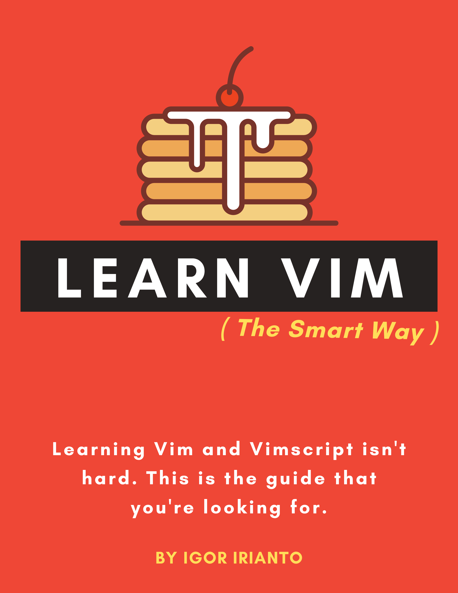

== Изучаем Vim (правильно)

=== Что это?

_Изучаем Vim (правильно)_ - это руководство по изучению лучших сторон Vim.

Существует много материалов для изучения Vim: `vimtutor` — отличной выбор для начала, а в справочном руководстве `help` содержатся все справочные материалы, которые вам когда-либо понадобятся. Тем не менее, среднему пользователю нужно что-то большее, чем `vimtutor`, и меньшее, чем справочное руководство `help`. Это руководство пытается преодолеть этот разрыв, выделяя только ключевые функции, для изучения наиболее полезных сторон Vim за максимально короткое время.

Это руководство написано как для начинающих, так и для продвинутых пользователей Vim. Оно начинается с широких и простых и заканчивается конкретными и продвинутыми понятиями. Если вы уже опытный пользователь, я бы в любом случае посоветовал вам прочитать это руководство от начала до конца, потому что вы узнаете что-то новое!

=== Я хочу больше советов по Vim!

Следите за https://twitter.com/learnvim[@learnvim] для получения обновлений, советов по Vim и т. д.

=== Поддержите этот проект

Это руководство есть и всегда будет бесплатным.

Если вы хотите финансово поддержать этот проект, вы можете https://leanpub.com/learnvim[купить это руководство на английском языке на Leanpub].

=== Оглавление

==== Пролог

* link:./ch00_read_this_first.md[Глава 0 - Сначала прочитайте это]

==== Часть 1: Изучаем Vim правильно

* link:./ch01_starting_vim.md[Глава 1 - Запуск Vim]
* link:./ch02_buffers_windows_tabs.md[Глава 2 - Буферы, окна и вкладки]
* link:./ch03_searching_files.md[Глава 3 – Открытие и поиск файлов]
* link:./ch04_vim_grammar.md[Глава 4 - Грамматика Vim]
* link:./ch05_moving_in_file.md[Глава 5 - Перемещение в файле]
* link:./ch06_insert_mode.md[Глава 6 - Режим вставки]
* link:./ch07_the_dot_command.md[Глава 7 - Команда Dot]
* link:./ch08_registers.md[Глава 8 - Регистры]
* link:./ch09_macros.md[Глава 9 - Макросы]
* link:./ch10_undo.md[Глава 10 - Отмена]
* link:./ch11_visual_mode.md[Глава 11 - Визуальный режим]
* link:./ch12_search_and_substitute.md[Глава 12 - Поиск и замена]
* link:./ch13_the_global_command.md[Глава 13 - Глобальная команда]
* link:./ch14_external_commands.md[Глава 14 - Внешние команды]
* link:./ch15_command-line_mode.md[Глава 15 - Режим командной строки]
* link:./ch16_tags.md[Глава 16 - Теги]
* link:./ch17_fold.md[Глава 17 - Сворачивание]
* link:./ch18_git.md[Глава 18 - Git]
* link:./ch19_compile.md[Глава 19 - Компиляция]
* link:./ch20_views_sessions_viminfo.md​​[Глава 20 - Просмотры, сеансы и Viminfo]
* link:./ch21_multiple_file_operations.md[Глава 21 - Операции с несколькими файлами]

==== Часть 2. Правильная настройка Vim

* link:./ch22_vimrc.md[Глава 22 - Vimrc]
* link:./ch23_vim_packages.md[Глава 23 - Пакеты Vim]
* link:./ch24_vim_runtime.md[Глава 24 - Среда выполнения Vim]

==== Часть 3. Изучаем Vimscript правильно

* link:./ch25_vimscript_basic_data_types.md[Глава 25 - Основные типы данных Vimscript]
* link:./ch26_vimscript_conditionals_and_loops.md[Глава 26 - Условные выражения и циклы Vimscript]
* link:./ch27_vimscript_variable_scopes.md[Глава 27 - Области видимости переменных Vimscript]
* link:./ch28_vimscript_functions.md[Ch 28 - функции Vimpscript]
* link:./ch29_plugin_example_writing-a-titlecase-plugin.md[Глава 29 - Пример плагина: написание плагина Titlecase]

=== Переводы

* https://github.com/wsdjeg/Learn-Vim_zh_cn[Изучаем Vim правильно на китайском](`zh-CN`)
* https://github.com/victorhck/learn-Vim-es[Изучаем Vim правильно на испанском](`es`)

=== Лицензия и авторские права

Все размещенные здесь материалы принадлежат © 2020-2021 Игорю Ирианто.

image:https://licensebuttons.net/l/by-nc-sa/4.0/88x31.png[link="http://creativecommons.org/licenses/by-nc-sa/4.0/"]

Эта работа находится под лицензией Creative Commons Attribution-NonCommercial-ShareAlike 4.0 International.
